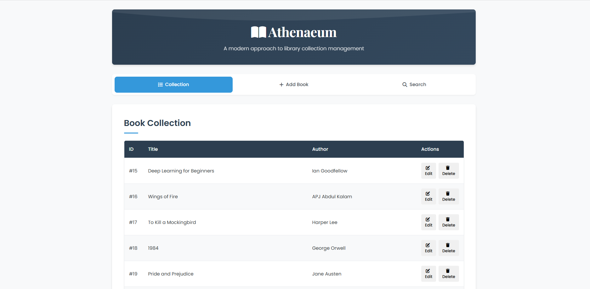
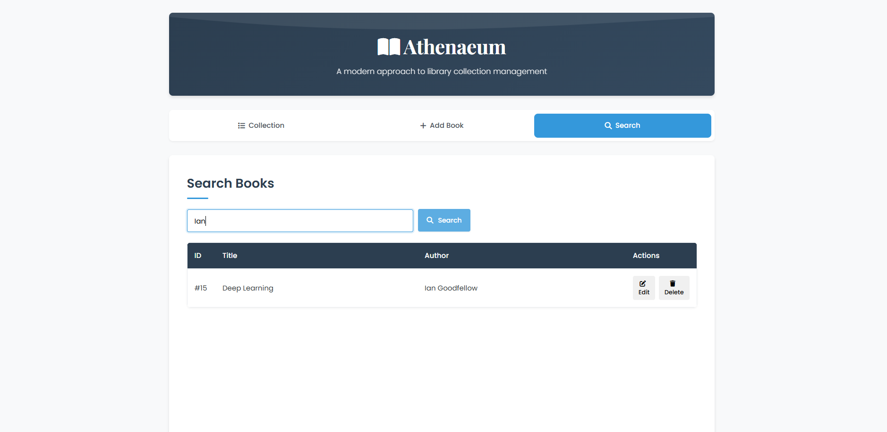

# Athenaeum - Library Management System


> A modern Java-based library management system with a responsive web frontend
## UI




## 📋 Overview

Athenaeum is a full-stack library management system built with a Java backend and a modern JavaScript/HTML/CSS frontend. The application provides an intuitive interface for librarians to manage their book collection efficiently with features including adding books, editing book information, removing books, and searching the collection.

This project demonstrates a comprehensive implementation of a RESTful API in Java connected to a MySQL database, with a responsive single-page web application as the frontend. The system follows modern design principles with a focus on user experience and performance.

## ✨ Features

- **Book Management**
  - View complete book collection in a sortable table format
  - Add new books with title and author information
  - Edit existing book details
  - Delete books from the collection
  - Search books by title or author

- **User Experience**
  - Modern, responsive design using CSS3
  - Intuitive tab-based navigation
  - Interactive modals for editing and confirming actions
  - Real-time feedback with toast notifications
  - Loading indicators for API operations
  - Error handling with user-friendly messages
  - Empty state displays for better user guidance

- **Technical Features**
  - RESTful API implemented in Java
  - Persistent data storage with MySQL
  - CORS support for cross-origin requests
  - Transaction management for data integrity
  - Responsive SPA without framework dependencies
  - Animated UI components for a modern feel

## 🛠️ Tech Stack

### Backend
- Java
- HttpServer (Java built-in) for SimpleApiServer
- Optional: Spark Java Web Framework for LibraryApiServer 
- JDBC for database connectivity
- MySQL as the database

### Frontend
- HTML5
- CSS3 (Flexbox, CSS Variables, Animations, Transitions)
- Vanilla JavaScript (ES6+)
- Font Awesome for iconography

## 🏗️ Architecture

### High-Level Architecture
```
+-------------------+      +-----------------+      +-----------------+
|                   |      |                 |      |                 |
|  Web Frontend     |<---->|  REST API       |<---->|  MySQL Database |
|  (HTML/CSS/JS)    |      |  (Java)         |      |                 |
|                   |      |                 |      |                 |
+-------------------+      +-----------------+      +-----------------+
```

### Directory Structure
```
library-management-system/
├── src/
│   ├── api/             # API endpoints implementations
│   │   ├── SimpleApiServer.java   # Built-in HttpServer implementation
│   │   └── LibraryApiServer.java  # Alternative Spark implementation
│   ├── dao/             # Data Access Objects
│   │   └── BookDAO.java # Book database operations
│   ├── db/              # Database connection management
│   │   └── DBConnection.java  # Database connection handling
│   ├── model/           # Data models
│   │   └── Book.java    # Book entity model
│   └── ui/              # Console UI (optional)
│       └── LibraryApp.java  # Console application interface
├── lib/                 # External libraries
│   ├── mysql-connector-j-9.3.0.jar  # MySQL JDBC driver
│   └── spark-core-2.9.3.jar # Spark framework (optional)
├── index.html           # Web frontend entry point
├── styles.css           # Styling for the web frontend
├── scripts.js           # Frontend JavaScript
├── db_setup.sql         # Database setup script
├── pom.xml              # Maven project configuration
└── README.md            # Project documentation
```

### Backend Components
The backend follows a layered architecture:

#### API Layer (`src/api/`)
- **SimpleApiServer.java** - HTTP server implementation using Java's built-in HttpServer
- **LibraryApiServer.java** - Alternative implementation using Spark Java framework

#### Data Access Layer (`src/dao/`)
- **BookDAO.java** - Provides CRUD operations for books

#### Database Layer (`src/db/`)
- **DBConnection.java** - Manages database connection

#### Model Layer (`src/model/`)
- **Book.java** - Represents the book entity

### REST API Endpoints

| Method | Endpoint           | Description                    | Parameters                         |
|--------|-------------------|--------------------------------|------------------------------------|
| GET    | /api/books        | Retrieve all books             | None                               |
| GET    | /api/books/{id}   | Get a specific book            | id: Book ID                        |
| GET    | /api/books?query= | Search for books               | query: Search term                 |
| POST   | /api/books        | Add a new book                 | JSON body with name, author        |
| PUT    | /api/books/{id}   | Update an existing book        | id: Book ID, JSON body with updates|
| DELETE | /api/books/{id}   | Delete a book                  | id: Book ID                        |

### Frontend Structure

The frontend is a single-page application with three main sections:
1. **Books Collection** - Displays all books in a table view
2. **Add Book** - Form for adding new books
3. **Search** - Interface for searching books by title or author

Modals are used for editing books and confirming deletions.

## ⚙️ Installation

### Prerequisites
- JDK 11 or higher
- Maven (for dependency management)
- MySQL Server
- Modern web browser

### Step 1: Clone the repository
```bash
git clone https://github.com/yourusername/library-management-system.git
cd library-management-system
```

### Step 2: Set up the database
1. Create a new MySQL database named `library_db`
```sql
CREATE DATABASE library_db;
```

2. Run the database setup script:
```powershell
mysql -u <username> -p library_db < db_setup.sql
```

### Step 3: Configure database connection
Update the database connection information in `src/db/DBConnection.java` if necessary:
```java
return DriverManager.getConnection("jdbc:mysql://localhost:3306/library_db", "your_username", "your_password");
```

### Step 4: Build the project
```powershell
mvn clean package
```

## 🚀 Usage

### Running the REST API Server

#### Option 1: Using the SimpleApiServer (Java's built-in HttpServer)
```powershell
cd "c:\path\to\project"
java -cp ".;lib\mysql-connector-j-9.3.0.jar;src" api.SimpleApiServer
```

#### Option 2: Using the LibraryApiServer (Spark Java)
```powershell
cd "c:\path\to\project"
java -cp ".;lib\mysql-connector-j-9.3.0.jar;lib\spark-core-2.9.3.jar;lib\gson-2.8.9.jar;src" api.LibraryApiServer
```

The server will start on port 8080 with API endpoints available at `http://localhost:8080/api`.

### Accessing the Web Interface
Open `index.html` in your web browser to access the application.

## 📝 API Reference

### GET /api/books
Returns a list of all books in the library.

**Response Format:**
```json
[
  {
    "id": 1,
    "name": "To Kill a Mockingbird",
    "author": "Harper Lee"
  },
  {
    "id": 2,
    "name": "1984",
    "author": "George Orwell"
  }
]
```

### GET /api/books/{id}
Returns details of a specific book.

**Parameters:**
- `id`: The ID of the book to retrieve

**Response Format:**
```json
{
  "id": 1,
  "name": "To Kill a Mockingbird",
  "author": "Harper Lee"
}
```

### GET /api/books?query={searchTerm}
Searches books by title or author.

**Parameters:**
- `query`: Search term to match against book titles or authors

**Response Format:**
Same as GET /api/books but filtered by search term.

### POST /api/books
Adds a new book to the library.

**Request Body:**
```json
{
  "name": "The Great Gatsby",
  "author": "F. Scott Fitzgerald"
}
```

**Response Format:**
```json
{
  "status": "success",
  "message": "Book added successfully"
}
```

### PUT /api/books/{id}
Updates an existing book.

**Parameters:**
- `id`: The ID of the book to update

**Request Body:**
```json
{
  "name": "Updated Book Title",
  "author": "Updated Author Name"
}
```

**Response Format:**
```json
{
  "status": "success",
  "message": "Book updated successfully"
}
```

### DELETE /api/books/{id}
Deletes a book from the library.

**Parameters:**
- `id`: The ID of the book to delete

**Response Format:**
```json
{
  "status": "success",
  "message": "Book deleted successfully"
}
```

## 🗄️ Database Schema

The application uses a simple database schema with a single table:

### Table: books

| Column | Type         | Description                   |
|--------|--------------|-------------------------------|
| id     | INT          | Primary key, auto-incremented |
| name   | VARCHAR(255) | Book title                    |
| author | VARCHAR(255) | Book author                   |

SQL for table creation:
```sql
CREATE TABLE IF NOT EXISTS books (
  id INT AUTO_INCREMENT PRIMARY KEY,
  name VARCHAR(255) NOT NULL,
  author VARCHAR(255) NOT NULL
);
```

## 🖥️ UI Components

### Navigation
Tab-based navigation with three main sections:
- Collection (default view)
- Add Book
- Search

### Book Collection View
- Table display with columns for ID, Title, Author, and Actions
- Edit and Delete buttons for each book
- Empty state display for when there are no books

### Add Book Form
- Input fields for book title and author
- Form validation
- Success/error message display
- Loading state during form submission

### Search Interface
- Search input with real-time feedback
- Results display in table format
- Empty state for no search results
- Error handling for failed searches

### Modals
- Edit Book modal with pre-populated form
- Delete Confirmation modal with book details
- Keyboard shortcuts (Escape to close)
- Click-outside-to-close functionality

## 🔧 Development

### Building from Source
```powershell
mvn clean compile
```

### Running in Development Mode
During development, you can use the following command to compile and run the application:
```powershell
mvn compile exec:java -Dexec.mainClass="api.SimpleApiServer"
```

### Code Style Guidelines
- Java: Follow standard Java conventions with camelCase for methods and variables
- JavaScript: Follow ES6+ standards with consistent indentation
- HTML/CSS: Use semantic HTML5 elements and CSS variables for theming

## 🧪 Testing

### Backend Testing
To run backend tests:
```powershell
mvn test
```

### Frontend Testing
Open the application in a browser and test the following functionality:
1. Loading and displaying books
2. Adding a new book
3. Searching for books
4. Editing book details
5. Deleting books
6. Handling error states
7. Responsive design on different screen sizes

## 📦 Deployment

### Server Requirements
- Java Runtime Environment 11+
- MySQL Server 5.7+
- At least 512MB RAM
- 1GB disk space

### Production Deployment Steps
1. Build the project with Maven:
```powershell
mvn clean package
```

2. Deploy the JAR file to your server:
```powershell
scp target\library-management-system-1.0-SNAPSHOT-jar-with-dependencies.jar user@your-server:/path/to/deployment
```

3. Set up the database on your production server:
```powershell
mysql -u <username> -p < db_setup.sql
```

4. Update the database connection details for production.

5. Run the application:
```powershell
java -jar library-management-system-1.0-SNAPSHOT-jar-with-dependencies.jar
```

### Hosting the Frontend
1. Upload the HTML, CSS, and JavaScript files to your web server
2. Update the API_BASE_URL in scripts.js to point to your API server:
```javascript
const API_BASE_URL = "https://your-api-server.com/api";
```

## 🤝 Contributing

Contributions are welcome! Please feel free to submit a Pull Request.

1. Fork the project
2. Create your feature branch (`git checkout -b feature/amazing-feature`)
3. Commit your changes (`git commit -m 'Add some amazing feature'`)
4. Push to the branch (`git push origin feature/amazing-feature`)
5. Open a Pull Request

## 📄 License

This project is licensed under the MIT License - see the LICENSE file for details.

## 📧 Contact

Project Link: [https://github.com/Epik-Whale463/Athenaeum-Library-Management-System](https://github.com/Epik-Whale463/Athenaeum-Library-Management-System)

---